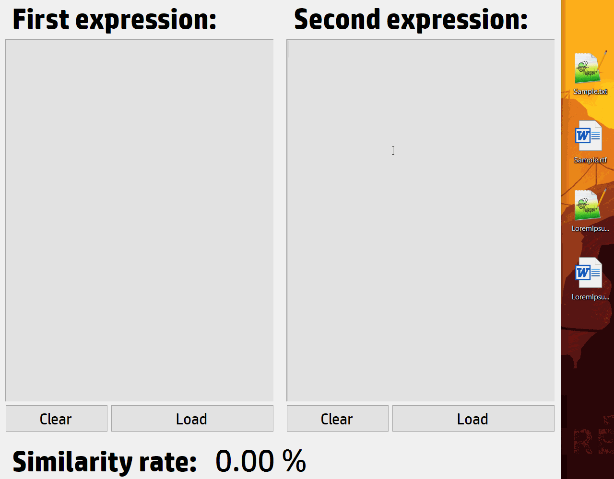

# Додаткове домашнє завдання для студентів другого курсу
#### Задача:

Створіть новий проект за шаблоном Windows Form (.NET Framework). Додайте до форми два поля для введення текстової інформації та поле для виведення поточного стану обробки. Під кожним із вхідних полів створіть дві кнопки: Clear та Load.

Обробка полягає в обчисленні відсотку схожості тексту у вхідних полях між собою та його виведення на екран у реальному часі, відповідно до внесених змін під час роботи програми. Текст у поля користувач може вписувати власноруч, або завантажувати з файлів, які мають розширення: *.txt, *.rtf, *.xml.

Необхідно реалізувати одночасно два способи завантаження файлів: через кнопку Load та через механізм DragAndDrop для вхідних текстових полів. 
Натискання Load повинно викликати діалогове вікно, де користувачу буде дозволено вибирати файли лише з вищенаведеними розширеннями. Якщо йому все ж вдасться вибрати невалідний файл, то програма повинна вивести на екран помилку та продовжити роботу. Ця вказівка актуальна й для механізму DragAndDrop.

Увесь код, пов’язаний з обробкою вхідних файлів, повинен бути винесений в окремий *.cs файл та структурований згідно патерну Strategy. Будь-яка взаємодія з файлами поза ним є недопустимою. Усі елементи форми повинні бути оголошенні зі специфікатором доступу private задля дотримання принципу інкапсуляції.

Кнопка Clear необхідна для очищення вхідного поля під яким вона знаходиться. Ця зміна також повинна бути врахована в поточній обробці.

Для успішної імплементації обробки вхідних полів варто ознайомитися з поняттям «Відстань Левенштейна» та алгоритмом знаходження цієї відстані. Варто врахувати, що зайві пробіли та регістр тексту ніяк не повинен впливати на результати обробки.

Додатково, задля кращого розуміння терміну «у реальному часі», варто ознайомитися з подією PropertyChanged та класом Binding, який дозволяє «зв’язувати» поля форми з властивостями класів.

#### Приклад виконання:

